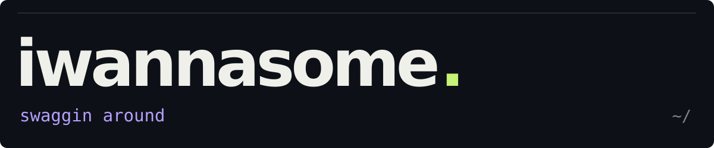
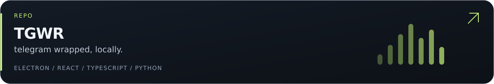
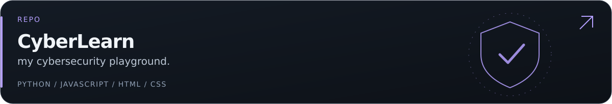
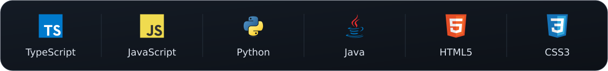
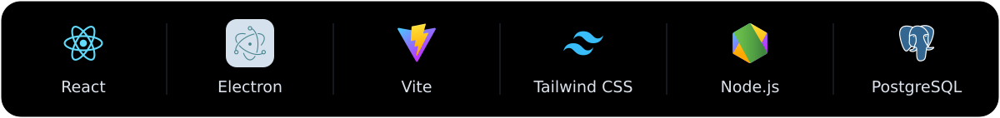
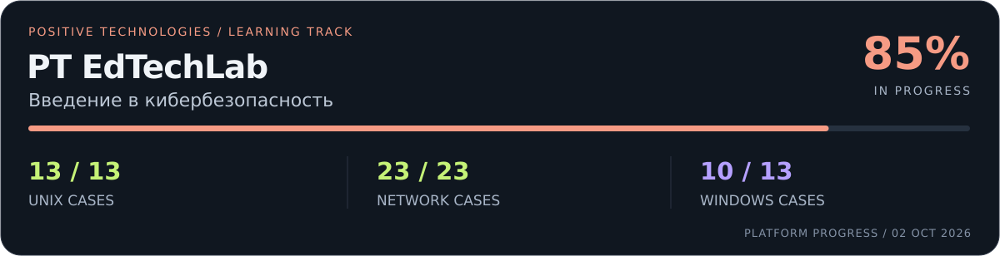
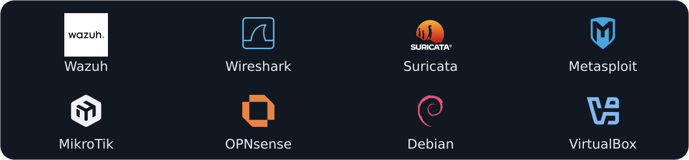

### привет, я даня

**сейчас в фокусе — перекат в cybersecurity.**

пишу TGWR и CyberLearn, копаюсь в linux, прохожу лабы. ниже — с чем уже успел повозиться.

  
  
  

### проекты

твоя переписка → твой wrapped. всё считается локально, результат можно забрать в PNG/PDF.

моя учебная площадка: уроки, локальные задания и дашборд прохождения.

### стек

из проектов и учебной практики.

еще из учебы

- PostgreSQL и DBeaver: SQL-запросы и проектирование баз.
- 1С:Предприятие, мобильная платформа, Android SDK — приложение с запуском на телефоне.
- VirtualBox, Debian, MikroTik и Suricata — учебные стенды и сети.

### cybersecurity / pt edtechlab

прохожу **«Введение в кибербезопасность»** от Positive Technologies. что уже было:

- **unix:** bash, права, процессы, службы, логи, Wazuh, контейнеризация.
- **сети:** Wireshark, MikroTik, адресация и маршрутизация, DNS, VLAN, NAT, OPNsense.
- **windows:** пользователи и политики, журналирование, ETW, Sysmon, основы AD, Kerberos и NTLM.

прогресс на платформе на 02.10.2026. курс еще идет, практика — в лабораторной среде.

### на репите

