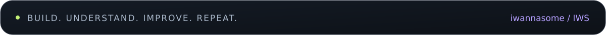

  

  <a href="#projects">Проекты</a> &nbsp; / &nbsp;
  <a href="#stack">Технологии</a> &nbsp; / &nbsp;
  <a href="#learning">Что изучаю</a>

### Привет, я Даниил 👋

Делаю приложения, разбираюсь в Linux и изучаю кибербезопасность. Мне интересно пройти весь путь: от идеи и интерфейса до данных, окружения и работающего результата.

**Сейчас в фокусе:** собственные проекты, SQL и базы данных, основы SOC / Blue Team.

## 01 / Технологии в моих проектах

Стек из личных проектов и учебной практики. Продолжаю изучать и применять его в работе над задачами.

## 02 / Из идеи в приложение

Экспорт Telegram превращается в персональную историю с аналитикой и карточками PNG/PDF. Обработка переписок — на компьютере пользователя.

Учебный проект с локальными уроками, практическими миссиями и дашбордом прохождения.

## 03 / За пределами кода

| Направление | С чем работаю и знакомлюсь |
| :--- | :--- |
| 🐧 **Linux и сети** | Терминал, процессы, права доступа, виртуальные машины и сетевые настройки |
| 🛡️ **Security labs** | VirtualBox, Debian, MikroTik, Suricata — в учебных лабораториях |
| 🗃️ **Базы данных** | PostgreSQL, DBeaver, SQL-запросы и проектирование баз |
| 📱 **1С и Android** | 1С:Предприятие, мобильная платформа, Android SDK и запуск на устройстве |

## 04 / На фоне играет

 

